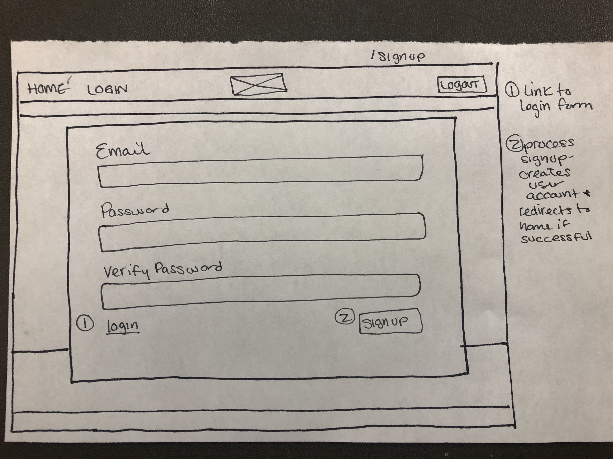
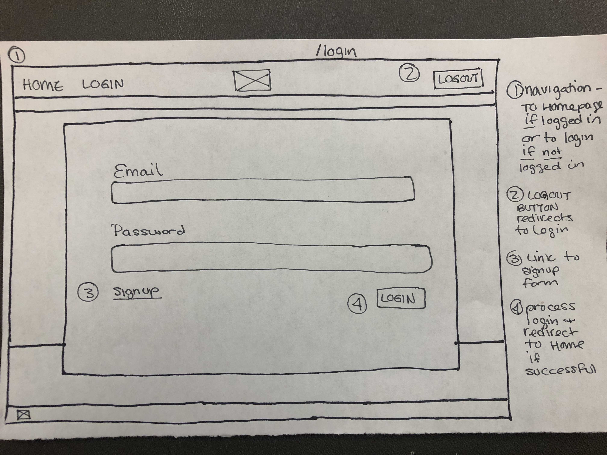
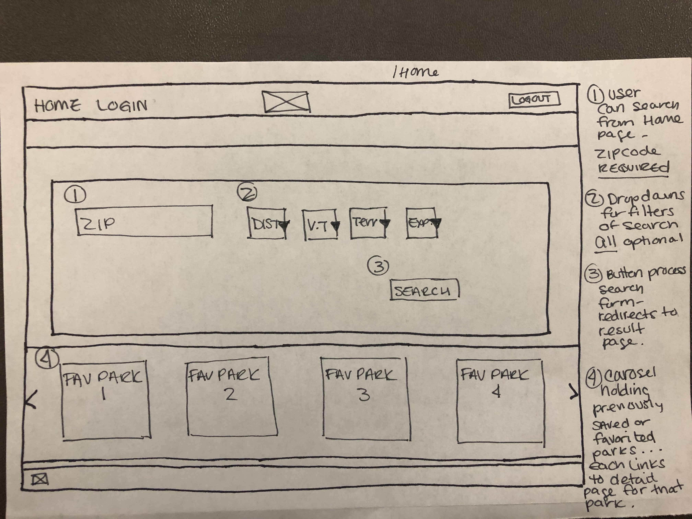
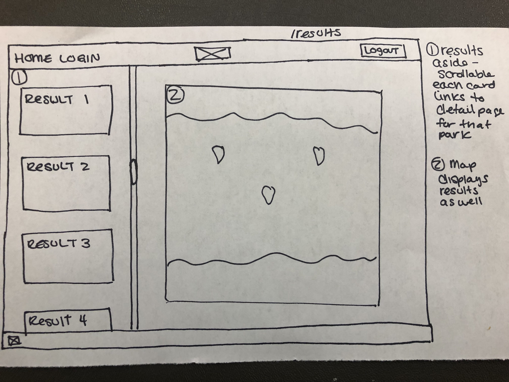
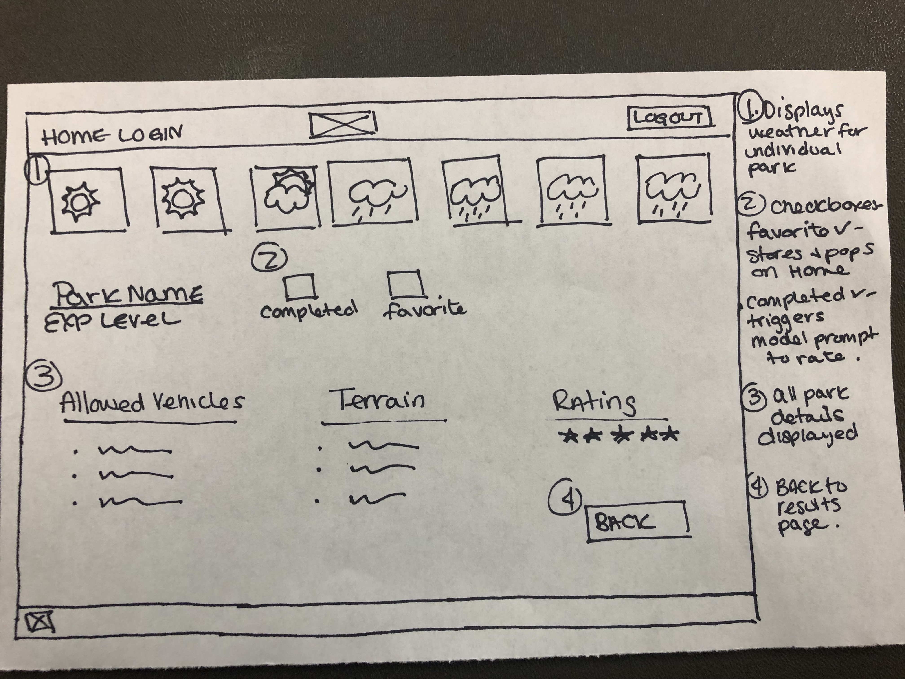
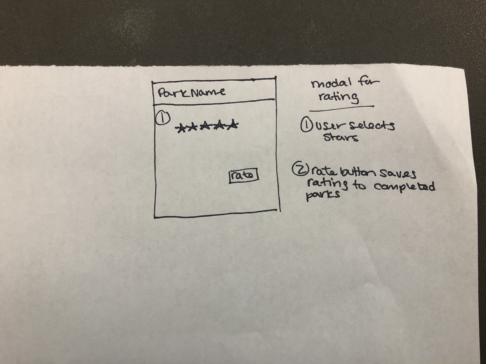

# trailer-queen

[Video Demonstration](https://drive.google.com/file/d/1SXnj5oTFpEBHZXPp3KounwVEN-i-S6q2/view)

[Video Demonstration](https://drive.google.com/file/d/14JoGhjxHgNnTvYFptlMZwvcM18OEp1MV/view?usp=sharing)

### Overview
My project will be an Off Road Park Locator that will allow users to search for trails based on their location and filter by specific criteria. Results of the user search will be displayed as plots on a map as well as clickable cards which link to detailed information on specific parks as well as showing a weather forecast for that trails location. 

Further, the user will be able to save their favorite trails, mark the trails as completed, and rate the trails based on specific criteria for their own later reference (difficulty, enjoyment, available facilities - like designated restroom facilities or onsite campsites or vehicle wash stations). 

Potential future features would include using a) completed tag to issue user badges or awards for completion criteria (not limited to: number of trails completed within distance of location, number of trails completed with a specific experience level) and b) populate an image carousel on the detail page using internet images of those specific trails if available.
### Features
1. User can **create an account and login**.
2. User can **SEARCH** for parks using zip codes and can **FILTER** results by distance from location, permitted vehicle types, terrain/obstacles, and recommended experience level for trail
3. Search results will populate as *plots on a map*, and *clickable cards* for each trail
4. User can **VIEW** all available trail info for a specific trail as well as a **7 day weather forecast** for the trail location by clicking on the search results.
5. User can rate trails, favorite trails (to **save** for later reference), and mark trails for completion (for possible future use of earning badges based on specific categories or criteria)
### Technologies
1. Java
2. Javascript
3. SpringBoot
4. Bootstrap
5. MySQL
6. APIs
### What I'll Have to Learn
In order to access the db containing the park information, I will need to learn the Google Maps GeoCoding API to convert the user address into lat/long points. 
### Project Tracker
[Final Project Trello - Jessica Howard](https://trello.com/invite/b/VbZ5bYxk/60d12e9f3a7b1efb34485b4b88be3676/final-project)
### Wireframes

